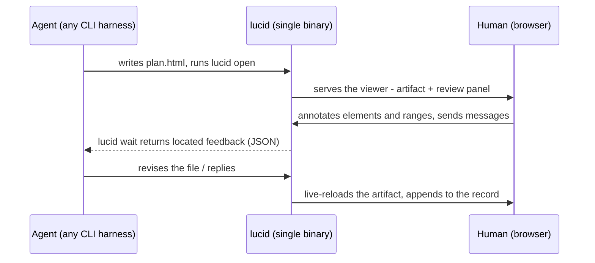

# Lucid

Point at the line. Say what you mean. The agent gets it.

Lucid is an agent-agnostic CLI. Your coding agent writes a response as an HTML
document - a plan, a report, a schema - and Lucid serves it in a browser where
you mark up individual elements and text ranges. Your notes go back to the agent
as located feedback. You never touch the CLI; the agent never renders the review.



## Why

A migration plan reads better as a document than as monospace prose scrolling
out of a terminal. And "change item 3" becomes a mark *on item 3*, with the
exact quote attached, so the agent acts on it without guessing what you meant.

Everything - annotations, messages, versions, approvals - lands in one
append-only log next to the artifact. Reviews suspend and resume, and any agent
can pick up one someone else started.

## Install

Requires [Bun](https://bun.sh) 1.3+. macOS and Linux.

```sh
bun install
bun run build     # -> dist/lucid, a self-contained binary
ln -s "$PWD/dist/lucid" ~/.local/bin/lucid
```

Then give your agent the skill. For Claude Code:

```sh
ln -s "$PWD/skills/lucid"        ~/.claude/skills/lucid
ln -s "$PWD/skills/lucid-design" ~/.claude/skills/lucid-design
```

Symlink rather than copy, so the skill can never describe a different version
than the binary you built. Other harnesses have their own skill directories, or
can read [`SKILL.md`](skills/lucid/SKILL.md) as a plain prompt.

Ask for a plan, and the agent opens one. The only commands you might run:

```sh
lucid open plan.html    # serve + open the review
lucid end  plan.html    # close the session
lucid                   # list sessions in this project
```

### One window over every session (the shell)

Instead of one browser tab per session, run the hub and get a single window
with a tab per review - every session across `~/dev`, a `⌘K` palette, and
`⌘1–9` tab switching:

```sh
lucid app               # start the hub (if needed) + open the shell as a Chrome app
lucid hub               # or run the hub daemon in the foreground yourself
```

While the hub is running, `lucid open` surfaces sessions as tabs in that one
window (`http://127.0.0.1:17428/`) rather than spawning per-session servers.
Agents notice nothing: `wait`/`ask`/`end` and the JSON payload are unchanged.

## How agents use it

The whole integration surface is a CLI and a JSON payload. No SDK, no plugin.

```sh
lucid open plan.html                       # prints an opening cursor
lucid wait plan.html --since <cursor>      # blocks until feedback; JSON on stdout
lucid wait plan.html --since <cursor> --reply "reordered the steps"
lucid ask  plan.html --text "batch or nightly?" --ref step-backfill
```

Anything that can run a subprocess and parse JSON can drive a review. The full
protocol is [docs/CONTRACT.md](docs/CONTRACT.md); the vocabulary is
[CONTEXT.md](CONTEXT.md).

## Contributing

```sh
bun run build          # bundles + dist/lucid
bun run typecheck && bun run lint
bun test test/*.test.ts
bunx playwright install chromium && bunx playwright test
```

A running viewer serves the bundle its binary embedded at compile time, so after
client changes rebuild **and** restart it - green tests against a stale bundle
are not green.

Conventions for coding agents: [AGENTS.md](AGENTS.md). Guidelines:
[CONTRIBUTING.md](CONTRIBUTING.md). Design system: [docs/DESIGN.md](docs/DESIGN.md).

```
src/cli        entry + commands       client/chrome    review panel (React)
src/core       log, fold, wait, lock  client/overlay   in-artifact marks (Lit)
src/server     loopback daemon        client/shared    postMessage protocol
src/anchors    anchor resolution      skills/          agent skills
```

## Roadmap

- **Skills in the binary** - `lucid skills install`, so a skill can never
  describe a different version of the CLI than the one that wrote it.
- **Stale-binary guard** - surface a bundle mismatch instead of relying on
  discipline.
- **Draft persistence** - submitted messages survive an outage and a reload (the
  outbox), but queued annotations are still client memory: a reload before
  sending loses them, along with their anchors and staged images.
- **Viewer follows its session** - a session that reopens on a different port
  strands the tab that was watching the old one. It reconnects to nothing, so
  undelivered work waits there instead of delivering itself.
- **Packaging** - prebuilt binaries and a published package.

## Thanks

Inspired by [lavish-axi](https://github.com/kunchenguid/lavish-axi) by
[@kunchenguid](https://github.com/kunchenguid): HTML is the format agents should
be writing when prose stops being enough, and the review belongs in a browser
rather than scrolling out of a terminal.

## License

[MIT](LICENSE), copyright Kevin Frilot.

Lucid inlines Lucide icon path data and compiles its dependencies into the
binary; those carry their own notices, reproduced in
[THIRD_PARTY_NOTICES.md](THIRD_PARTY_NOTICES.md).
