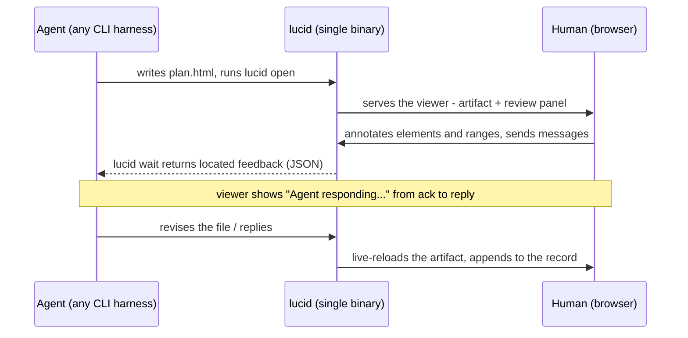
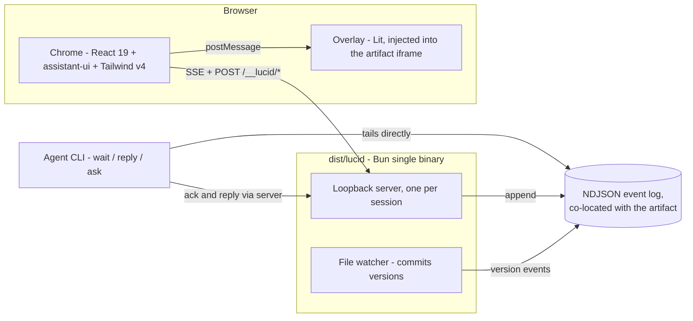
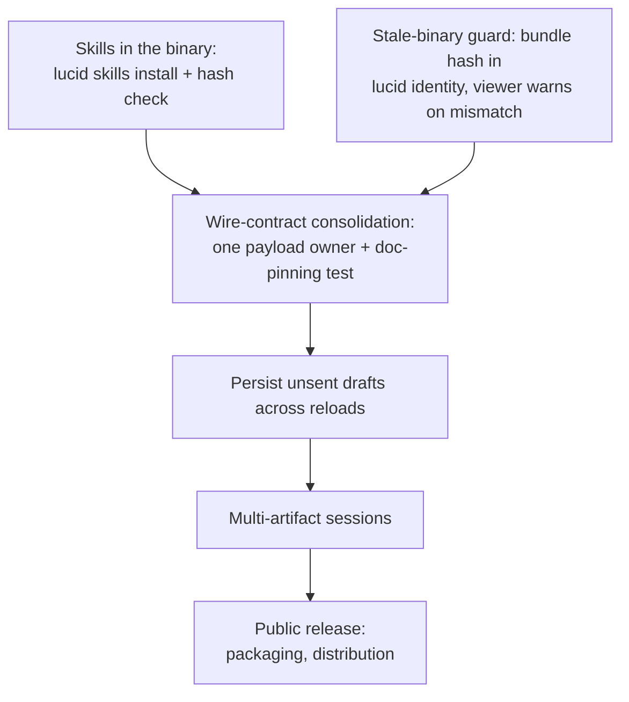

# Lucid

Point at the line. Say what you mean. The agent gets it.

Lucid is an agent-agnostic CLI that lets a terminal coding agent render a
response as a free-form, **addressable** HTML artifact - a plan, a report, a
schema, an option matrix - which a human reviews in a browser and marks up at
the level of individual elements and text ranges. Located feedback loops back
to the agent through a co-located, append-only event log that any harness can
read or resume. The human never touches the CLI; the agent never renders the
review.



## Why

- **Legibility.** A migration plan reads better as a document than as
  monospace prose scrolling out of a terminal.
- **Addressability.** Every element and text range of the agent's output is a
  target. "Change item 3" becomes a mark *on item 3*, with the exact quote and
  a note - feedback the agent acts on without guessing what you meant.
- **A durable record.** Annotations, messages, questions, reverts, versions
  and approvals live in one append-only NDJSON log next to the artifact.
  Sessions suspend and resume; any agent can bootstrap from the log and
  continue a review someone else started.

## Quickstart

Requires [Bun](https://bun.sh) 1.3.0 or newer. Linux and macOS.

```sh
bun install
bun run build     # browser bundles + single self-contained binary -> dist/lucid
```

`dist/lucid` embeds everything - viewer, overlay, stylesheets - so it works
offline, binds loopback only, and needs nothing on disk at runtime. Put it on
your PATH with a symlink into any directory already there:

```sh
ln -s "$PWD/dist/lucid" ~/.local/bin/lucid       # or /usr/local/bin, /opt/homebrew/bin
```

The commands a human might ever run:

```sh
lucid open plan.html    # serve + open the review in your browser
lucid end  plan.html    # close the session
lucid                   # status of discoverable sessions
```

Everything else is the agent's business.

## How agents integrate (any agent)

Lucid is harness-agnostic on purpose. The whole integration surface is a CLI
and a JSON payload - no SDK, no plugin, no callbacks:

```sh
lucid open plan.html                          # prints an opening nextCursor
lucid wait plan.html --since <cursor>         # blocks until feedback; JSON on stdout
# ...act on annotations/messages, revise the file (the viewer live-reloads)...
lucid wait plan.html --since <cursor> --reply "reordered the steps"
lucid ask  plan.html --text "batch or nightly?" --ref step-backfill
```

The payload carries located annotations (each with the anchored element or
quoted range, a note, and any pasted images as absolute paths the agent can
read), unlocated messages, answered questions, revert decisions, and an
approval signal. Delivery is at-least-once with idempotent IDs; agents persist
`nextCursor` between calls. The full protocol is
[docs/CONTRACT.md](docs/CONTRACT.md); the canonical vocabulary is
[CONTEXT.md](CONTEXT.md).

Anything that can run a subprocess and parse JSON can drive a review: Claude
Code, Codex, a cron job, a shell script.

### Presence, honestly

When an agent takes delivery of feedback, the CLI appends an acknowledgement
to the log and the viewer shows *"Agent responding..."* with elapsed time,
until the agent's next output - a revision, a reply, a question - closes it.
The indicator is driven entirely by the log, so it cannot claim work that is
not happening; after ten minutes of silence it degrades to a plain statement
that nothing has come back. If it never appears after you send, nothing took
delivery. Silence is a signal, not a mystery.

### Attended and standing reviews

By default the agent runs `wait` **in the foreground and blocks its turn**: a
review is a moment, the agent has nothing better to do than listen, and
feedback lands the instant you hit send. This is the default, and the
[skill](skills/lucid/SKILL.md) enforces it.

The opt-in alternative is a **standing review**: the same loop as a background
process, for a long-lived artifact - a roadmap, a living spec - that should
keep its reviewer while the terminal conversation moves on. The skill's rules
for it are strict: exactly one attendant per artifact, exit on suspend, end,
or approval, and never run silently. Ask your agent for a "standing review"
to get one; the default does not change.

## Agent skills

`skills/` ships two skills that install into a Claude Code skills directory
and read fine as prompts for any other harness:

- **[`skills/lucid`](skills/lucid/SKILL.md)** - when and how to render
  responses as artifacts and drive the review loop. The consumer manual,
  versioned with the CLI it documents.
- **[`skills/lucid-design`](skills/lucid-design/README.md)** - the design
  system (ink/cream/brass tokens, type rules, UI kit) for building
  Lucid-branded interfaces, including this repo's own chrome.

Install by symlink so they can never drift from the binary you built. For
Claude Code, that is `~/.claude/skills/`:

```sh
ln -s "$PWD/skills/lucid"        ~/.claude/skills/lucid
ln -s "$PWD/skills/lucid-design" ~/.claude/skills/lucid-design
```

Claude Code surfaces every skill as a slash command, so this also gives you
`/lucid` to invoke a review explicitly - though the skill is written to trigger
on its own when a response wants to be an artifact. Other harnesses have their
own skill directories, or can read `SKILL.md` as a plain prompt; substitute
your own path.

If your dotfiles are managed by GNU Stow, put a **relative** symlink inside
the stowed tree instead, computed against the repo's real location (for
sibling repos under `~/dev`: `../../../../lucid/skills/lucid`). Stow passes
nested symlinks through in both folded and `--no-folding` modes, and the link
travels with your dotfiles repo. On a machine without this repo cloned, the
link dangles loudly instead of serving a stale copy - which is the point.

## Architecture



Choices that matter:

- **The log is the source of truth.** Append-only, lock-serialized single
  appender, globally monotonic `seq` cursor, torn-tail tolerant, folded to
  state per lifecycle segment. The server is a writer; agents read the log
  off disk; the chrome renders folded state and never trusts itself.
- **Two bundles on purpose.** The artifact runs in a sandboxed iframe on an
  opaque origin - its scripts cannot reach the control routes - and receives
  only the small Lit overlay. React never enters a document Lucid does not
  own.
- **Anchors that fail honestly.** Element anchors resolve lucidId ->
  fingerprint -> domPath; ranges resolve quote -> position (the W3C Web
  Annotation model). Resolution runs against the authored snapshot, then
  carries forward to the current version; failures orphan into a tray rather
  than mis-target.
- **Chronology is honest.** Annotations carry the time they were written, not
  the time they were sent, so the record reads in the order things happened
  even when feedback sat queued while the conversation moved on.
- **Loopback-only security.** Host/Origin validation, path-traversal and
  symlink scoping, a dotfile denylist, an enumerated asset-extension
  allowlist. Non-loopback binding is never offered.

## Layout

```
src/
  cli/        @effect/cli entry + command implementations + daemon spawn
  core/       event log, fold, versions, wait, cursor, paths, lock
  server/     Bun.serve daemon, overlay injection, viewer page, security
  anchors/    anchor schema + shared DOM resolution (browser + linkedom)
  diff/       version-to-version artifact diffing
  plan/       planner-document rendering and feedback ingest (see docs/PLANNER.md)
client/
  chrome/     the review panel (React + assistant-ui + Tailwind)
  overlay/    in-artifact targeting and highlights (Lit)
  shared/     the postMessage protocol between them
skills/       the lucid and lucid-design agent skills
scripts/      build-client (embed bundles) + build-binary (compile)
test/         bun unit/integration + Playwright e2e
docs/         the agent contract
```

## Development

```sh
bun run build:client   # browser bundles + Tailwind
bun run build          # + compile dist/lucid
bun run typecheck && bun run lint
bun test test/*.test.ts        # unit/integration
bunx playwright install chromium && bunx playwright test   # end-to-end
```

A running viewer serves the bundle its binary embedded at compile time: after
client changes, rebuild **and** restart the viewer. Green tests against a stale
bundle are not green.

Conventions for coding agents working on this repo: [AGENTS.md](AGENTS.md).
How to contribute: [CONTRIBUTING.md](CONTRIBUTING.md).

## Thanks

Lucid owes its premise to [lavish-axi](https://github.com/kunchenguid/lavish-axi)
by [@kunchenguid](https://github.com/kunchenguid), which got there first: HTML is
the format agents should be writing when prose stops being enough, and the review
belongs in a browser rather than scrolling out of a terminal. Lavish worked out
the shape of the thing - a CLI that serves an agent-written page, an overlay that
makes it annotatable, sessions keyed by file path, and a skill that teaches the
agent when to reach for it at all. Lucid goes somewhere different from there, and
the [differences are real](#architecture), but the starting insight was not ours.
Worth naming.

## Roadmap



- **Skills distribution** - embed `skills/` in the binary like the client
  bundle, with `lucid skills install` and a staleness check, so an installed
  skill can never describe a different version of the CLI than the one that
  wrote it.
- **Stale-binary guard** - a running viewer serves the bundle its binary
  embedded at compile time; surface a mismatch instead of relying on
  discipline.
- **Wire-contract consolidation** - the payload shape is currently maintained
  in the server, the client types, and the contract doc; one owner plus a
  test asserting the documented example against a real payload.
- **Draft persistence** - queued annotations are client memory today; a
  reload before sending loses them.
- **Packaging and distribution** - the binary is built from source today.
  Prebuilt release artifacts and a published package are not set up yet.

## License

[MIT](LICENSE), copyright Kevin Frilot.

Lucid inlines Lucide icon path data and compiles its dependencies into the
binary; those carry their own notices, reproduced in
[THIRD_PARTY_NOTICES.md](THIRD_PARTY_NOTICES.md).
